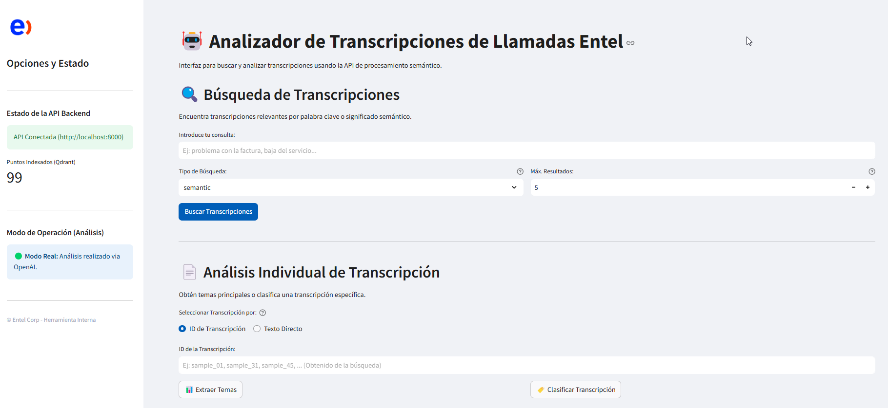

# 🤖 Assessment AI Engineer - Análisis Semántico de Transcripciones (Entel GenAI)

Este repositorio contiene la solución para el assessment de AI Engineer del equipo GenAI de Entel. El proyecto implementa un sistema backend escalable para analizar semánticamente transcripciones de llamadas de atención al cliente, utilizando la API de OpenAI de forma optimizada y la base de datos vectorial Qdrant.

## 📝 Descripción General

El sistema permite:

- **🔍 Búsqueda:** Encontrar transcripciones relevantes mediante palabras clave o significado semántico, consultando eficientemente la base de datos vectorial Qdrant.
- **📊 Extracción de Temas:** Identificar los temas principales discutidos en una conversación, usando llamadas asíncronas a OpenAI para no bloquear la API.
- **🏷️ Clasificación Automática:** Asignar categorías predefinidas (ej: "Problemas Técnicos", "Soporte Comercial") a las llamadas, mediante llamadas asíncronas a OpenAI.

Se ha desarrollado priorizando la escalabilidad (uso de Qdrant y asyncio), eficiencia (procesamiento batch de embeddings) y una gestión cuidadosa del presupuesto de OpenAI ($5 USD).

## ✨ Características Principales

- **Backend API:** Construido con FastAPI, proporcionando endpoints RESTful para búsqueda y análisis. Operaciones asíncronas para un análisis no bloqueante.
- **Base de Datos Vectorial:** Utiliza Qdrant (ejecutado vía Docker) para almacenar embeddings y texto, permitiendo búsquedas semánticas y por palabra clave rápidas y escalables.
- **Procesamiento NLP:**
  - Se utiliza `text-embedding-3-small` de OpenAI para búsqueda semántica. Los embeddings se generan en lotes y se almacenan en Qdrant.
  - Se emplea `gpt-4o-mini` de OpenAI para la extracción de temas y clasificación mediante llamadas asíncronas.
- **Optimización de Costos:**
  - Generación batch de embeddings para minimizar las llamadas a la API.
  - Uso de modelos eficientes (`text-embedding-3-small` y `gpt-4o-mini`).
  - Modo de simulación controlable (configurable vía `ENABLE_OPENAI_CALLS` en el archivo `.env`) para desarrollo y pruebas sin consumir créditos de OpenAI.
- **Preprocesamiento:** Limpieza de texto, manejo de transcripciones en formato `.txt` y anonimización de PII (incluyendo RUT chileno) con Presidio.
- **Interfaz:** Frontend básico desarrollado con Streamlit para interactuar con la API.

## Interfaz

A continuación se muestra una vista previa del frontend:




## ⚙️ Configuración del Entorno

Sigue estos pasos para configurar el proyecto localmente (probado en Windows con PowerShell, adaptable a Linux/Mac):

1. **Instalar Docker**  
   Asegúrate de tener Docker Desktop instalado y en ejecución. Es necesario para Qdrant.

2. **Clonar el Repositorio**
   ```bash
   git clone https://github.com/mateogon/GenAI_Entel_Assessment.git
   cd GenAI_Entel_Assessment
   ```

3. **Crear y Activar el Entorno Virtual**
   ```bash
   python -m venv .venv
   # En PowerShell, podrías necesitar ajustar la política de ejecución:
   # Set-ExecutionPolicy -ExecutionPolicy RemoteSigned -Scope CurrentUser
   .venv\Scripts\Activate.ps1
   ```
   *(En Linux/Mac: `source .venv/bin/activate`)*

4. **Instalar Dependencias**
   ```bash
   pip install -r requirements.txt
   ```
   Esto instalará FastAPI, Uvicorn, Streamlit, OpenAI, Qdrant client, Presidio, spaCy, etc.

5. **Descargar el Modelo de Lenguaje spaCy** *(necesario para Presidio)*
   ```bash
   python -m spacy download es_core_news_md
   ```

6. **Configurar la API Key de OpenAI**
   - Crea un archivo llamado `.env` en la raíz del proyecto.
   - Añade tu clave de API:
     ```
     OPENAI_API_KEY=sk-TuClaveRealDeOpenAIaqui
     ```

7. **Control del Modo de Simulación**
   - Para deshabilitar las llamadas reales a GPT (modo simulación, recomendado para pruebas):
     ```
     ENABLE_OPENAI_CALLS=false
     ```
   - Para habilitar las llamadas reales (consumirá créditos):
     ```
     ENABLE_OPENAI_CALLS=true
     ```
   *Si la línea `ENABLE_OPENAI_CALLS` no existe, se operará en modo simulación (false) por defecto.*

8. **Colocar Datos Crudos**  
   Asegúrate de que las 100 transcripciones en formato `.txt` (ej: `sample_01.txt`) estén dentro de la carpeta `data/raw/`.

## 🚀 Ejecución

### Iniciar Qdrant (Base de Datos Vectorial)
Abre una terminal y ejecuta:
```bash
docker run -d --name qdrant_db -p 6333:6333 qdrant/qdrant
```
El puerto `6333` es para la API y para la UI web ([http://localhost:6333/dashboard](http://localhost:6333/dashboard)).

### Preparar Datos y Generar Embeddings  
*(Ejecutar solo una vez inicialmente o si los datos cambian)*

1. **Preprocesamiento (Limpieza y Anonimización)**
   ```bash
   python scripts/preprocess_data.py
   ```
   Este script lee los archivos `.txt` de `data/raw/`, los limpia/anonimiza y guarda archivos `.json` en `data/processed/`.

2. **Generación de Embeddings e Indexación en Qdrant**  
   *(Asegúrate de que `ENABLE_OPENAI_CALLS=true` en `.env` si es la primera vez o si necesitas regenerar embeddings)*
   ```bash
   python scripts/generate_embeddings_openai.py
   ```
   Este script lee los archivos JSON procesados, genera embeddings en lotes usando la API de OpenAI y los inserta en Qdrant. Si la colección ya existe, te preguntará si deseas recrearla (lo cual borrará los datos actuales).

### Iniciar el Backend (API FastAPI)

- **Para desarrollo simple (Windows/Linux/Mac)**
  ```bash
  uvicorn app.main:app --reload --host 0.0.0.0 --port 8000
  ```

- **Alternativa para Windows (simulando un servidor de producción robusto)**
  ```bash
  # Instala waitress si aún no lo hiciste: pip install waitress
  waitress-serve --host 0.0.0.0 --port 8000 app.main:app
  ```

- **Para producción en Linux/Docker (recomendado)**
  ```bash
  # Instala gunicorn: pip install gunicorn
  gunicorn -w 4 -k uvicorn.workers.UvicornWorker app.main:app --bind 0.0.0.0:8000
  ```
  *(Ajusta el número de workers (`-w 4`) según tus recursos.)*

La API estará disponible en [http://localhost:8000](http://localhost:8000).  
Accede a la documentación interactiva en:
- **Swagger UI:** [http://localhost:8000/docs](http://localhost:8000/docs)
- **ReDoc:** [http://localhost:8000/redoc](http://localhost:8000/redoc)

### Iniciar el Frontend (Streamlit - Opcional)

Abre otra terminal en la raíz del proyecto, activa el entorno virtual y ejecuta:
```bash
streamlit run frontend.py
```
Se abrirá automáticamente una pestaña en tu navegador (usualmente en [http://localhost:8501](http://localhost:8501)).

## ⚙️ Arquitectura y Decisiones Técnicas

- **Backend:** FastAPI por su rendimiento, soporte nativo para `asyncio` y auto-documentación.
- **Procesamiento de Texto Crudo:** Scripts en Python que utilizan expresiones regulares y Presidio para el parseo y la anonimización.
- **Almacenamiento y Búsqueda:** Qdrant se emplea como base de datos vectorial. Almacena los embeddings y el texto completo anonimizado, permitiendo búsquedas semánticas y por palabra clave sin necesidad de cargar todos los datos en RAM.
- **Análisis (Temas/Clasificación):** Uso de `gpt-4o-mini` de OpenAI a través de AsyncOpenAI para extraer temas y clasificar transcripciones.
- **Generación de Embeddings:** Optimizada mediante llamadas batch a la API de OpenAI (`get_embeddings_batch`), reduciendo la latencia y la cantidad de llamadas.
- **Gestión de Presupuesto:** Uso de modelos eficientes, batching y modo de simulación (`ENABLE_OPENAI_CALLS`) para controlar el gasto.
- **Escalabilidad:**
  - **Datos:** Qdrant permite escalar el almacenamiento de datos vectoriales y textuales más allá de la memoria RAM.
  - **Concurrencia en la API:** `asyncio` en FastAPI y llamadas asíncronas a OpenAI facilitan el manejo de múltiples peticiones simultáneas.
  - **Ingesta:** El procesamiento batch acelera la carga inicial y las actualizaciones masivas.
- **Despliegue:** Se recomienda el uso de Gunicorn (Linux/Docker) o Waitress con múltiples instancias detrás de un balanceador de carga para aprovechar múltiples núcleos o máquinas.
- **Frontend:** Streamlit permite crear prototipos de UI de forma rápida y sencilla.

## 📖 Documentación de la API

La API backend, construida con FastAPI, expone endpoints RESTful para realizar búsquedas y análisis sobre las transcripciones.

*   **Documentación Interactiva (Auto-generada):** La forma más completa y actualizada para explorar los endpoints, ver los esquemas de datos exactos y probar la API directamente desde el navegador está disponible cuando el backend está en ejecución:
    *   Swagger UI: [http://localhost:8000/docs](http://localhost:8000/docs)
    *   ReDoc: [http://localhost:8000/redoc](http://localhost:8000/redoc)

*   **Documentación Detallada y Ejemplos:** Para una descripción más detallada de cada endpoint, explicaciones de casos de uso, ejemplos prácticos con `curl`, y ejemplos de respuestas JSON, por favor consulta el documento dedicado:
    *   **➡️ [Ver Documentación Detallada de la API (API_DOCUMENTATION.md)](API_DOCUMENTATION.md)**